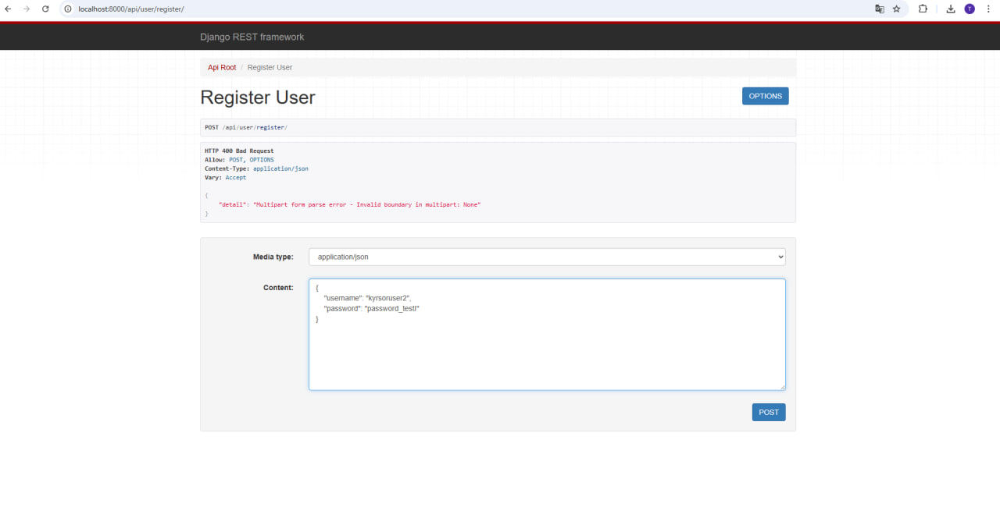
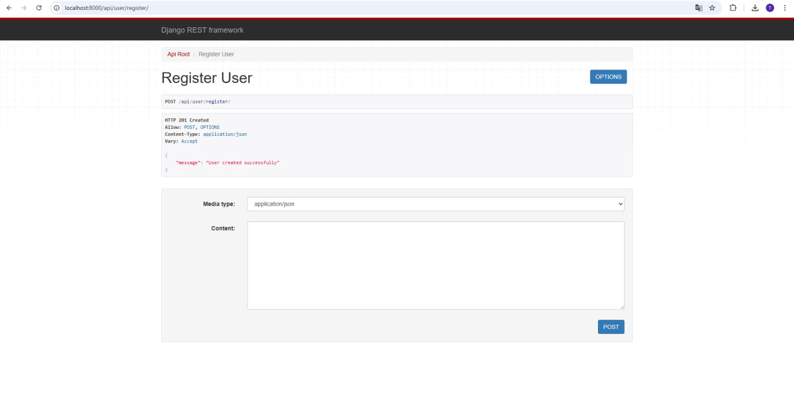
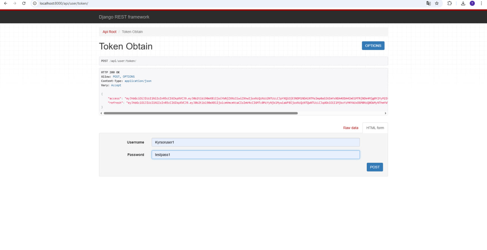
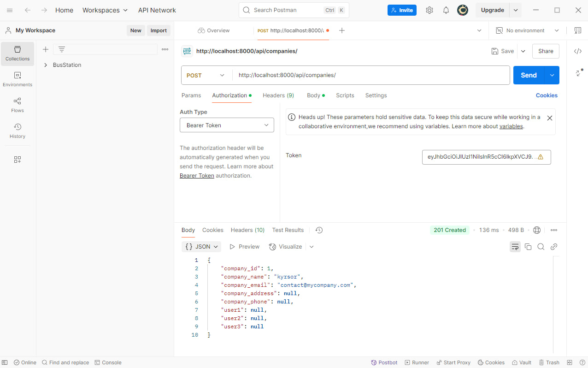
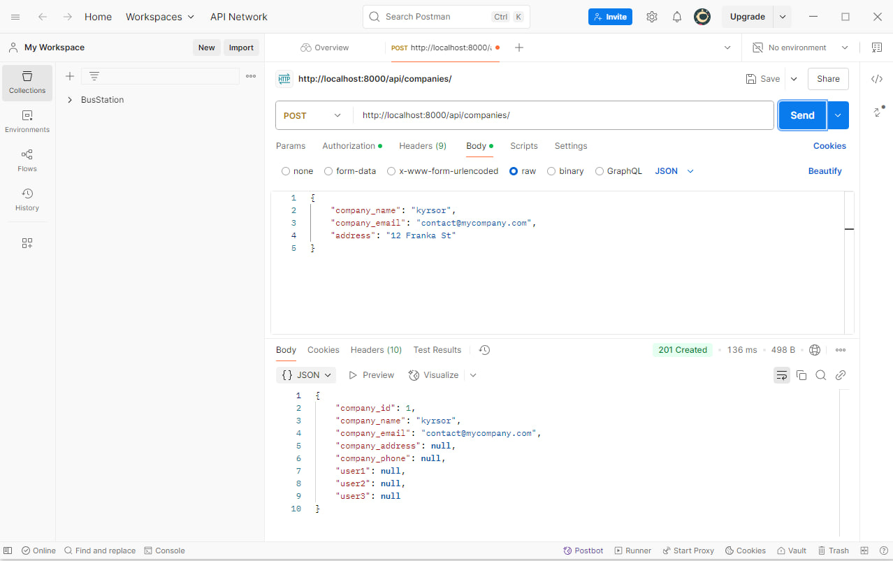
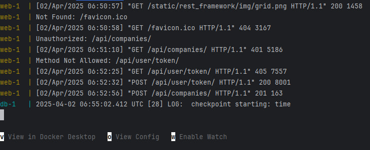
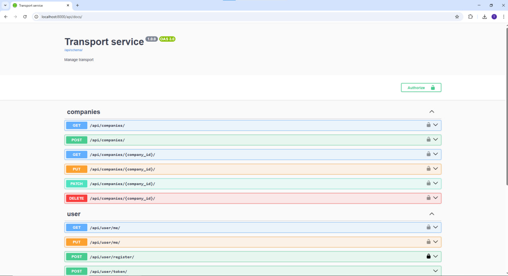
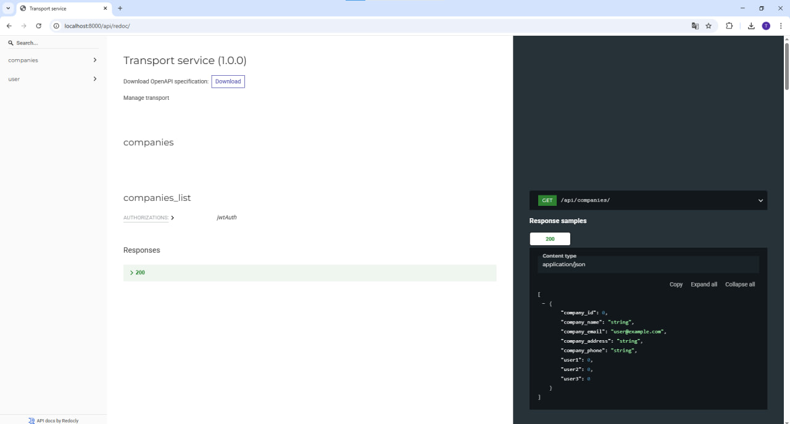

# Company endpoint

## Description

This project is a RESTful API that provides monitoring and maintenance control for vehicles. The system includes various entities such as users, companies, and devices, ensuring efficient tracking and management of vehicle maintenance.

## Technologies Used

- Python 3
- Django
- Django REST Framework (DRF)
- PostgreSQL
- Docker

## Features

- CRUD operations for companies
- User authentication and registration
- Token-based authentication
- API documentation using Swagger, Redoc

## Setup

### Prerequisites

Ensure you have the following installed:

- Docker & Docker Compose

### Installation

1. Clone the repository:

   ```sh
   git clone https://github.com/Postpostman/company_endpoint.git
   cd company_endpoint
   ```

2. Create a `.env` file and configure the necessary environment variables.

3. Build and start the Docker containers:

   ```sh
   docker-compose up --build
   ```

4. Apply database migrations:

   ```sh
   docker-compose exec web python manage.py migrate
   ```

5. Create a superuser:

   ```sh
   docker-compose exec web python manage.py createsuperuser
   ```

6. Collect static files:

   ```sh
   docker-compose exec web python manage.py collectstatic --noinput
   ```

## API Endpoints

### Authentication

- `POST /api/token/` - Obtain access and refresh tokens
- `POST /api/token/refresh/` - Refresh access token
- `POST /api/register/` - Register a new user

### Company Management

- `GET /api/companies/` - List all companies
- `POST /api/companies/` - Create a new company
- `GET /api/companies/{id}/` - Retrieve a specific company
- `PUT /api/companies/{id}/` - Update a company
- `PATCH /api/companies/{id}/` - Partially update a company
- `DELETE /api/companies/{id}/` - Delete a company

## Testing

To test API endpoints, use Postman or Swagger UI at:

```
http://localhost:8000/docs/
```

## Logs and Debugging

To check logs while running Docker:

```sh
docker-compose logs -f web
```


Ensure the following settings in `settings.py`:

```python
MEDIA_URL = '/media/'
MEDIA_ROOT = os.path.join(BASE_DIR, 'media')
```

## CORS Configuration

To enable CORS, install and configure `django-cors-headers`:

```sh
pip install django-cors-headers
```

Add to `INSTALLED_APPS` in `settings.py`:

```python
INSTALLED_APPS = [
    ...
    'corsheaders',
]
```

And update `MIDDLEWARE`:

```python
MIDDLEWARE = [
    'corsheaders.middleware.CorsMiddleware',
    ...
]
```

## Screenshots
Registration process


Registration success


Get token


Postman token using during POST method


Postman result after POST method sent


Pycharm log after success POST


Swagger doc


Redoc doc
